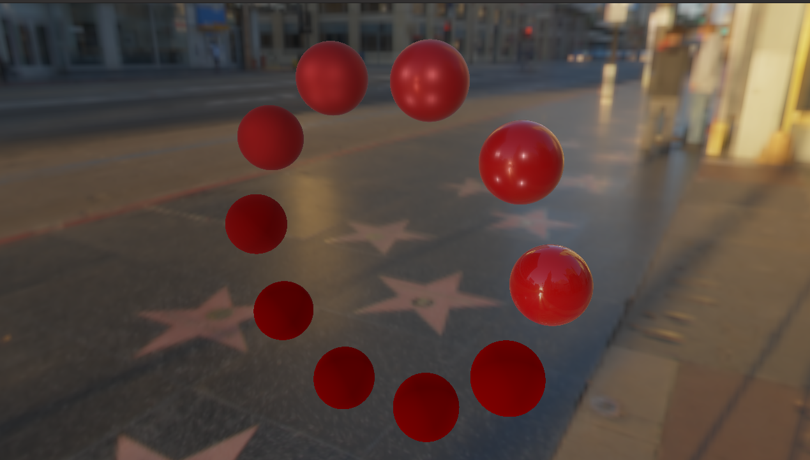

 Render output, spheres of varying metallic and roughness factors at the Walk of Fame
## About

I went through the [learnOpenGL](https://learnopengl.com/) tutorials to learn about writing code in openGL and computer graphics in general. Going from the getting started section to the end of the PBR section and taking the time to understand everything took quite a while, so here is the code for a basic PBR renderer. WHen running the program, you can move around using WASD constrols and space to move up and shift to move down

## Build and Run
I compiled this on Ubuntu 20.04 using g++ version 8.4.0. I included a simple makefile so simply running
```console
make
```
should work and the render can be viewed with
```console
./main
```
## Dependencies
- [stb_image](https://github.com/nothings/stb)
- [GLFW](https://www.glfw.org/) (for window creation)
- GLM (can be installed with apt install)
- [GLAD](https://github.com/Dav1dde/glad)

## Future Work

To understand PBR better, I am working through the [PBR book](https://pbrt.org/).

## Sources

- [learnOpenGL](https://learnopengl.com/)
- [Physics and Math of Shading](https://blog.selfshadow.com/publications/s2013-shading-course/hoffman/s2013_pbs_physics_math_notes.pdf) (to understand BRDF and PBR better)
